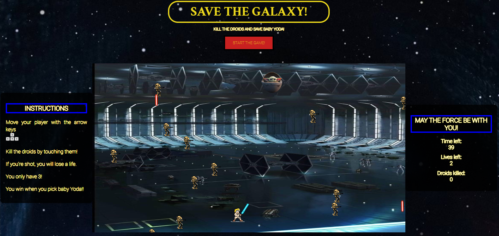
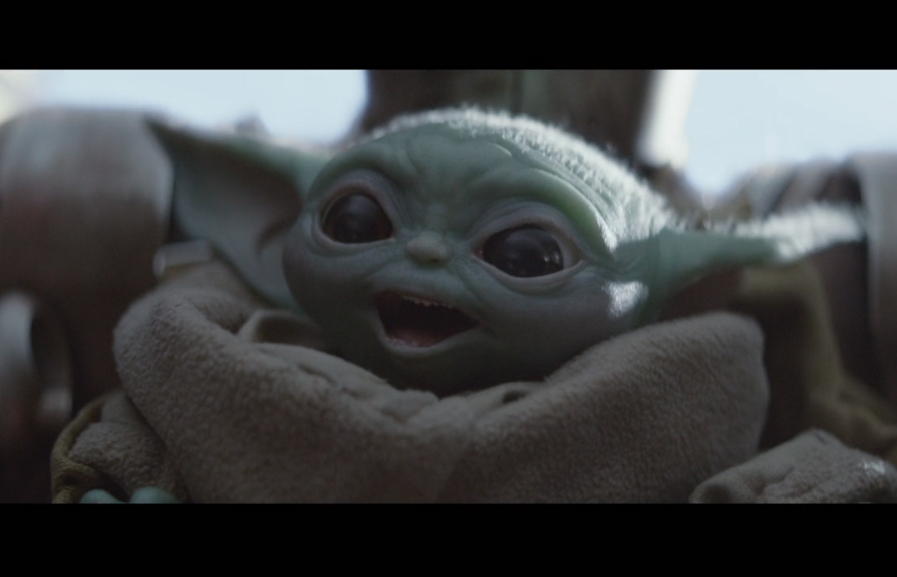

# Star Wars Canvas Game: Save the galaxy! 



## Description

Welcome to Save the Galaxy Game, where you play as Luke Skywalker on a mission to rescue Baby Yoda. This game is built using HTML, CSS, and JavaScript with Canvas.

Dodge enemy droids, shoot them down, and save Baby Yoda from Darth Vader! The game features a fun and engaging gameplay experience, inspired by the beloved Star Wars universe.

## Features

- Control Luke Skywalker using arrow keys to move (right, left, up, down).
- Defeat enemy droids by touching them with your lightsaber.
- Rescue Baby Yoda to win the game.
- Track your lives, score, and time remaining.
- Enjoy immersive Star Wars-themed graphics and sounds.

## Installation

1. Clone the repository:

   ```bash
   git clone https://github.com/MariaG6/save-the-galaxy.git
   ```

2. Navigate to the project directory:

   ```bash
   cd save-the-galaxy
   ```

3. Open `index.html` in your preferred web browser.


## How to Play

1. Use the arrow keys to navigate Luke Skywalker through the battlefield.
2. Dodge enemy droids and their attacks.
3. Kill the droids by touching them!
4. Reach Baby Yoda to win the game and save the day!

 CLICK TO PLAY --> https://mariag6.github.io/save-the-galaxy/
 <h2  align="center"> MAY THE CODE BE WITH YOU! </h2>
 

 
 

